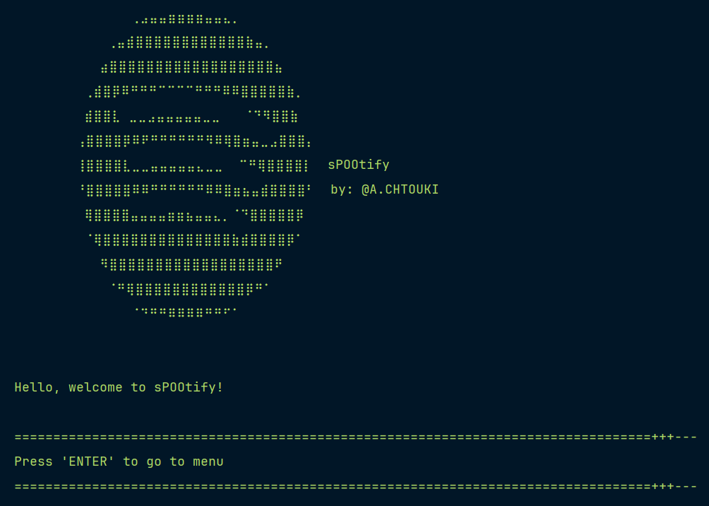

# **Spotify-Like Playlist Application**

**Screenshot**
_________________

A project developed for the Object-Oriented Programming course to apply and enhance OOP concepts. The application reproduces some of Spotify’s core features, including creating and managing playlists, adding or removing content, and listing the tracks within a playlist.
